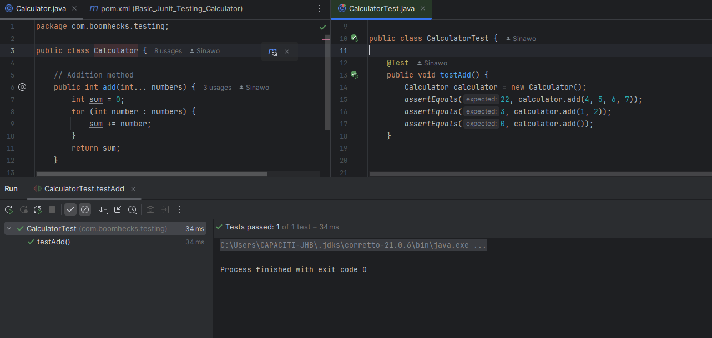
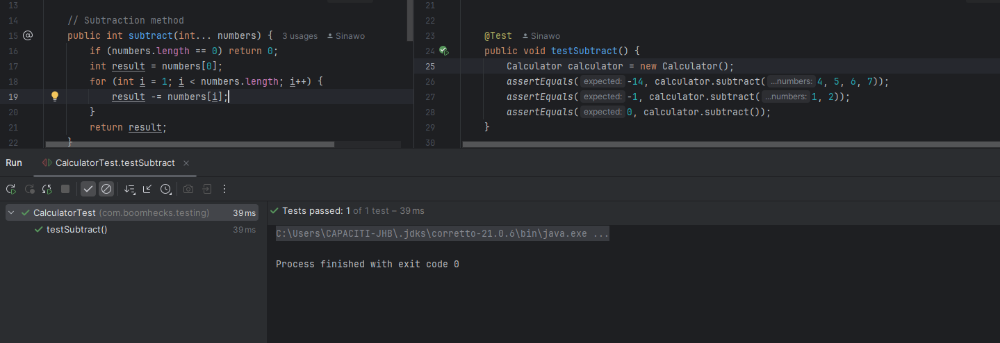
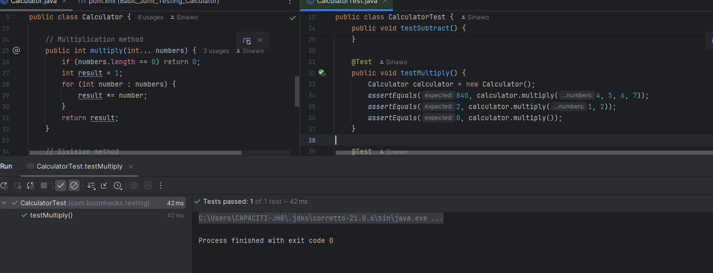
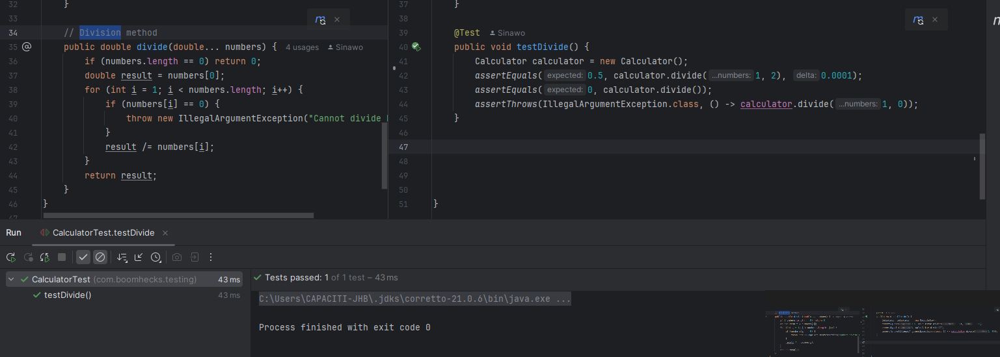

# Basic JUnit Testing Calculator

## 📚 Project Overview

This project implements a **basic calculator** using Java, and it's tested using **JUnit**. The calculator performs basic arithmetic operations like addition, subtraction, multiplication, and division. The goal of this project is to demonstrate how to apply unit testing to a simple application.

### 🧪 Features:
- Addition
- Subtraction
- Multiplication
- Division

## ⚙️ How to Run

To run the calculator and tests, follow the steps below:

1. **Clone the repository**:
   ```bash
   git clone https://github.com/Sinawo/Basic_Junit_Testing_Calculator.git


<details>
  <summary>Click to see the slideshow</summary>

    

    


    

    


</details>

